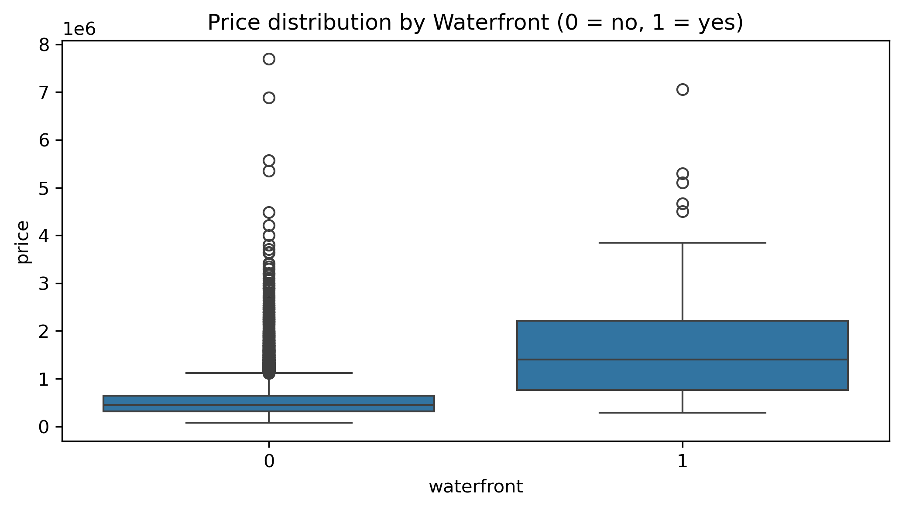
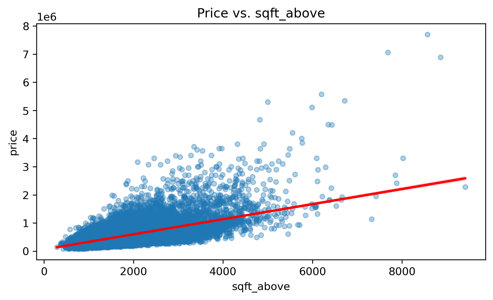
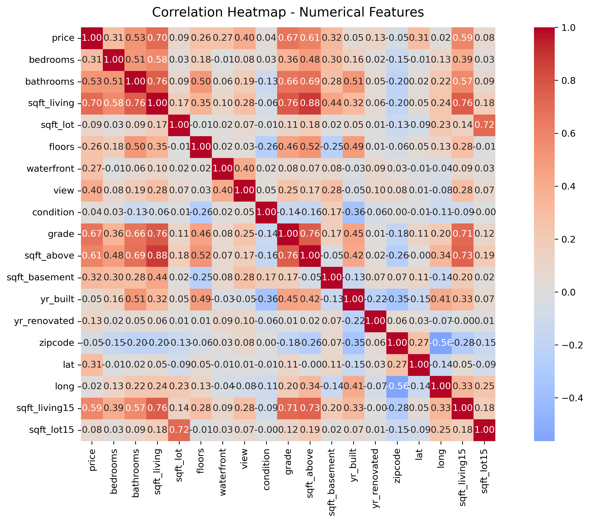

# IBM Data Analysis – House Prices Prediction

Projeto final do curso **Data Analysis with Python (IBM)**, com foco em aplicar as principais etapas de um pipeline de Ciência de Dados: análise exploratória, limpeza, visualização e modelagem preditiva.  
O objetivo foi prever o preço de venda de imóveis no condado de King (EUA), analisando os fatores que mais influenciam o valor final.

## Estrutura do Projeto

- **House_Sales_in_King_Count_USA.ipynb** – Notebook principal  
- **housing.csv** – Dataset utilizado  
- **README.md** – Documentação do projeto  
- **LICENSE** – Licença MIT

## Contexto

O dataset contém registros de vendas de imóveis no **King County (EUA)**, que inclui Seattle, entre maio de 2014 e maio de 2015.  
Cada linha representa uma propriedade e suas características físicas, geográficas e estruturais.

As principais variáveis incluem:
- `sqft_living`: área útil da casa (em pés²)  
- `bedrooms`, `bathrooms`: número de quartos e banheiros  
- `floors`: número de andares  
- `grade`: qualidade da construção  
- `sqft_above`: área útil acima do nível do solo  
- `sqft_living15`: média da área útil das 15 casas mais próximas  
- `price`: variável-alvo (preço de venda)

## Etapas do Projeto

### 1. Importação e Exploração Inicial
- Carregamento do dataset e inspeção de tipos de dados  
- Avaliação da distribuição das variáveis  
- Verificação de valores ausentes e duplicados

### 2. Limpeza e Preparação dos Dados
- Remoção de duplicatas  
- Conversão de tipos  
- Normalização e padronização de colunas numéricas  

### 3. Análise Exploratória e Visualização

A análise exploratória teve como objetivo identificar padrões, outliers e correlações relevantes.  
Alguns dos gráficos gerados durante o processo estão destacados abaixo:

#### Distribuição de Preços por Waterfront

#### Relação entre Preço e Área Acima do Solo

#### Mapa de Correlação das Variáveis Numéricas

### 4. Modelagem
Foi desenvolvido um modelo de **Regressão Linear** para prever o preço com base nas variáveis mais relevantes.

### 5. Avaliação do Modelo
As métricas de desempenho foram calculadas com base nos dados de teste:

- **R² (coeficiente de determinação)**: 0.70  
- **RMSE (Root Mean Squared Error)**: 130,000 (aprox.)

Esses resultados indicam que o modelo é capaz de capturar boa parte da variabilidade do preço com base nas variáveis estruturais e de área.

## Tecnologias Utilizadas

- Python 3.10  
- Pandas  
- NumPy  
- Matplotlib  
- Seaborn  
- Scikit-learn  

## Resultados e Insights

As variáveis com maior impacto sobre o preço foram:

| Variável | Correlação com o preço |
|-----------|------------------------|
| `sqft_living` | 0.70 |
| `grade` | 0.67 |
| `sqft_above` | 0.60 |
| `bathrooms` | 0.53 |

Esses fatores refletem a influência direta da metragem e da qualidade da construção no valor de mercado das propriedades.

---

## Autor

**Bernardo Corral**  
Estudante de Ciência de Dados  
[GitHub](https://github.com/BernardoCorral) • [LinkedIn](https://www.linkedin.com/in/bernardocorral/)

